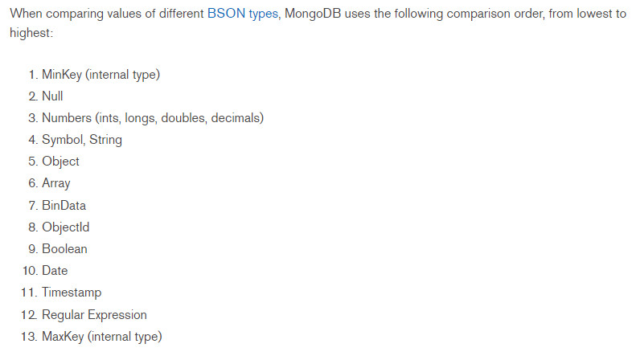

#### 一、mysql 中的数据类型

mysql 支持多种的数据类型，主要包括**整数类型**、**日期/时间类型**、**字符串类型**。

* 数值数据类型：包括整数类型 **TINYINT**、**SMALLINT**、**MEDIUMINT**、**INT**、**BIGINT**，浮点小数数据类型 **FLOAT**、**DOUBLR**，定点小数类型 **DECIMAL**。

* 日期/时间类型：包括 **YEAR**、**TIME**、**DATE**、**DATETIME**、**TIMESTRAMP**。

* 字符串类型：包括 **CHAR**、**VARCHAR**、**BINARY**、**VARBINARY**、**BLOB**、**TEXT**、**ENUM**、**SET** 等等。字符串类型又分为字符串和二进制字符串。 

#### 二、整型的类型宽度
这些显示宽度能够保证显示每一种数据类型可以取到取值范围内的所有值。例如 TINYINT 有符号和无符号数的取值范围分别为 -128~127 和 0~255，由于负号占了一个数字位，因此 TINYINT 默认的显示宽度为 4。同理，其他整数类型的默认显示宽度与其有符号数的最小值的宽度相同。

#### 三、mysql 如何选择类型
mysql 提供了大量的数据类型，为了优化存储，提高数据库性能，在审核情况下均应使用 **最精确** 的类型。即在所有可以表示该列值的类型中，该类型使用的存储最少。

* 整数和浮点数
    * 如果不需要小数部分，则使用整数来保存数据；如果需要表示小数部分，则使用浮点数类型。对于浮点数据列，存入的数值会对该列定义的小数位进行四舍五入。若使用整数，则 MEDIUMINT UNSIGNED 是最好的类型，若需要存储小数，则使用 FLOAT 类型。
    
    * 浮点数包括 FLOAT 和 DOUBLE 类型。DOUBLE 类型精度比 FLOAT 类型高，因此如要求存储精度较高时，应选择 DOBLE 类型。

* 浮点数和定点数
    
    * 浮点数 FLOAT、DOUBLE 相对于定点数 DECIMAL 的优势是：在长度一定的情况下，浮点数能表示更大的数据范围，但是由于浮点数容易产生误差，因此对精度要求比较高时，建议使用 DECIMAL 类存储。DECIMAL 在 mysql 中是以字符串存储的，用于定义货币等对精确度要求比较高的数据。在数据迁移中，float(M, D) 是非标准的 SQL 定义，数据库迁移可能会出现问题，最好不要这样使用。另外两个浮点数进行减法和比较运算时也容易出问题。因此在进行计算的时候，一定要小心。如果进行数值比较，最好使用 DECIMAL 类型。

* 日期与时间类型
    
    * mysql 对于不同种类的日期和时间有很多的数据类型，比如 YEAR 和 TIME。如果只需要记录年份，则使用 YEAR 类型即可，如果只记录时间，只需使用 TIME 类型。 
    
    * 如果同时需要记录日期和时间，则可以使用 TIMESTAMP 或者 DATETIME 类型。由于 TIMESTAMP 列的取值范围小于 DATETIME 的取值范围，因此存储较大的日期最好使用 DATETIME。
    
    * TIMESTAMP 也有一个 DATETIME 不具备的属性。在默认的情况下，当插入一条记录但并没有指定 TIMESTAMP 这个列时，mysql 会把 TIMESTAMP 列设置为当前时间并且在查询是会自动进行时区的转化。因此当需要插入当前时间，使用 TIMESTAMP 是方便的，另外 TIMESTAMP 在空间上比 DATETIME 更有效。

* CHAR 与 VARCHAR 之间的特点
    
    * CHAR 与 VARCHAR 的区别如下：
        
        * CHAR 是固定长度字符，VARCHAR 是可变长度的字符。
        
        * CHAR 会自动删除插入数据的尾部空格，VARCHAR 不会删除尾部空格。
        
    * CHAR 是固定长度，所以他的处理速度比 VARCHAR 的速度更快，但是他的缺点是浪费存储空间。所以对存储不大，但在速度上有要求的可以使用 CHAR 类型，反之可以使用 VARCHAR 类型来实现。
    
    * 存储引擎对于选择 CHAR 和 VARCHAR 的影响
     
        * 对于 MyISAM 存储引擎：最好使用固定长度的数据列代替可变长度的数据列。这样可以使整个表静态化，从而使数据检索更快，用空间交换时间。
        
        * 对于 InnoDB 存储引擎：使用可变长度的数据列，因为 InnoDB数据表的存储格式不分固定长度和可变长度，因此使用 CHAR 不一定比使用 VARCHAR 更好，但由于 VARCHAR 是按照实际长度存储的，比较节省空间，所以对磁盘 I/O 和数据存储总量比较好。
        
* ENUM 和 SET
    
    * ENUM 只能取单值，他的数据列表是一个枚举集合。他的合法取值列表最多允许有 65535 个成员。因此，在需要从多个值中选取一个时，可以使用 ENUM。比如：性别字段适合定义为 ENUM 类型，每次只能从 “男” 或者 “女”中取一个值。 

    * SET 可取多个值。他的合法取值列表最多允许 64 个成员。空字符串也是一个合法的 SET 值。在需要取多个值的时候，适合使用 SET 类型，比如：要存储一个人的兴趣爱好，最好使用 SET 类型。
    
    * ENUM 和 SET 的值是以字符串的形式出现的，但在内部，MySQL 以数值的形式存储他们。
    
* BLOB 和 TEXT

    * BLOB 是二进制字符串，TEXT 是非二进制字符串，两者均可存放大容量的信息。BLOB 主要存储图片、音频信息等，而 TEXT 只能存储纯文本文件。

#### 四、mongodb 中的数据类型

在 mongodb 中使用的是 **BSON** 类型。**BSON**是一种二进制的序列格式被用来存储文档数据（[BSON 规范](http://bsonspec.org/)）。

    

[文档参考](https://docs.mongodb.com/manual/reference/bson-type-comparison-order/)

#### 五、mongodb 一些特定类别的说明

* objectId 类型

    * objectId 是小的，唯一的，有顺序的，并且能够快速的生成。objectId 包含了 12 位。
        *  a 4-byte value representing the seconds since the Unix epoch
        
        *  a 3-byte machine identifier
        
        *  a 2-byte process id, and
        
        *  a 3-byte counter, starting with a random value
        
    * 在 mongodb 中一般会添加 **_id** 字段作为唯一的主键，其类型就是 **objectId**，如果你未主动设置 **_id** 字段，mongodb 会主动帮你设置好。
    
    * 通过 **ObjectId.getTimestamp()**，可以得到文档创建时间
    
    * 通过 **_id** 排序，大致就是按 create_time 排序。
    
* string 类型

    * BSON string 是采用 utf8 编码的。通常来说，程序语言的驱动在操作数据库的时候也会转化为 utf8 编码。另外，在mongodb的 **$regex** 查询中，其正则字符串，也是支持 utf8编码的。但是尽量不要在 string 上，使用 **sort()** 排序。
    
* timestamps 类型

    * mongodb 有指定的时间戳类型，这和 **date** 类型是并不相关的。timestamps 类型由 64 位构成。
    
        * the first 32 bits are a time_t value (seconds since the Unix epoch)
        
        * the second 32 bits are an incrementing ordinal for operations within a given second.
        
    * BSON timestamps 是 mongodb 内部使用的类型，在大多数情况下，用户一般使用 Date 类型就可以了。
    
* date 类型

    * BSON Date 类型是一个 64 bit 的类型。代表了从过去到未来 2.9 亿年。
    
    * 他的时间类型为 UTC datatime

    

