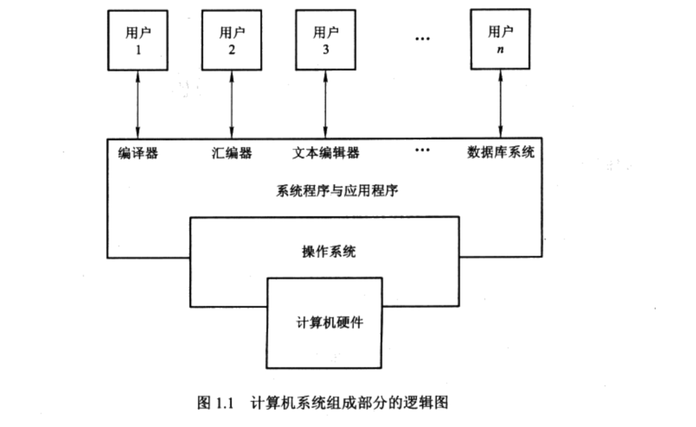
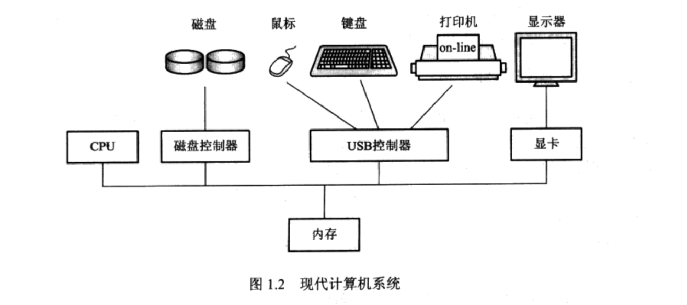
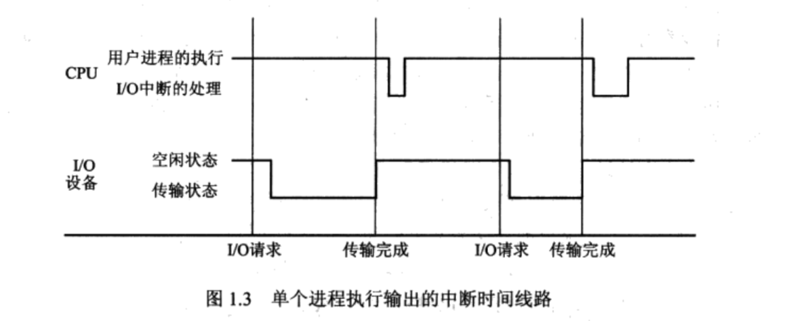
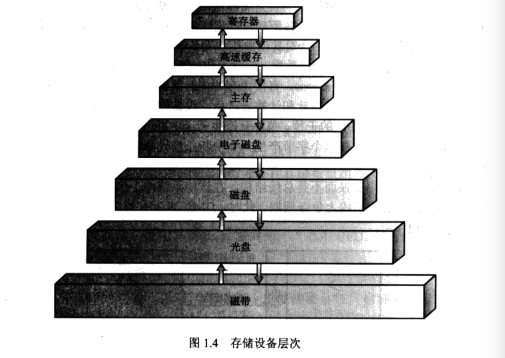

### 一、初识操作系统

#### 1、简单的理解操作系统
操作系统是管理计算机硬件的软件，作为计算机硬件和计算机用户之间的中介的程序。操作系统的目的是为用户提供方便且有效的执行程序的环境。而硬件必须提供合适的机制来保证计算机系统的正确运行，以及确保系统不受用户程序干扰正常运行。

#### 2、操作系统擅长的领域也是有差异的
根据不同的适用场景，所用的操作系统的侧重点也是不同的，这在设计操作系统的时候，就已经决定好了。举例来说：大型机的操作系统设计的主要目的是为了充分优化硬件的使用率，个人计算机的操作系统设计时为了能支持从复杂的游戏到商业应用的各种事物，手持计算机的操作系统是为了给用户提供一个可以与计算机方便交互并执行程序的环境

#### 3、计算机系统的构成
计算机系统大致分为 4 个组成部分：计算机硬件、操作系统、系统程序与应用程序、用户，具体如下图所示：

### 二、计算机系统组织

#### 1、计算机系统操作
现代通用计算机系统由一个或者多个CPU和若干个设备控制器通过共同的总线相连而成，该总线提供了对共享内存的访问。每个设备控制器负责一种特定类型的设备（如磁盘驱动器、音频设备、视频显示器）。CPU与设备控制器可以并发工作，并竞争内存周期。为了确保对共享内存的有序访问，需要内存控制器来协调对内存的访问。

当打开电源或重启时，计算机开始运行，他需要运行一个初始化程序。该初始化程序比较简单，通常位于 ROM 或者 EEPROM 中，称为计算机硬件中的固件。他初始化系统中的所有部分，包括 CPU 寄存器、设备控制器和内存内容。初始化程序必须知道如何装入操作系统并开始执行系统。为了完成这一目标，初始化程序必须定位操作系统内核并把它装入内存。接着，操作系统开始执行第一个进程，并等待事件的发生。

事件的发生通常通过硬件或者软件**中断**来表示。硬件可随时通过系统总线向CPU发出信号，已触发**中断**。软件通过执行特别操作如**系统调用**也能触发**中断**。

当CPU**中断**时，他暂停正在做的事并立即转到固定的位置去继续执行，该固定位置通常时中断服务程序开始位置的地址。中断服务程序开始执行，在执行完后，CPU重新执行被**中断**的计算。这一操作的时间线路如图：

中断是计算机结构中的重要部分。每个计算机设计都有自己的中断机制，但是有些功能是公共的。中断必须将控制转移到合适的中断处理程序。处理转移的简单方法是调用一个通用的子程序以检查中断信息。接着，该子程序会调用相应的中断处理程序。

#### 2、计算机的存储结构

计算机程序必须在内存（或随机访问内存（RAM））中以便运行。内存是处理器可以直接访问的唯一的大容量存储区域（数兆到数千兆字节）。他通常使用被称为**动态随机访问内存**的半导体技术来实现的，是一组内存字的数组，每个字都有其地址。通过对特定内存地址执行一系列 load 或 store 指令来实现交互。指令 load 能将内存中的字移到 CPU 的寄存器中，而指令 store 能将寄存器的内容移到内存。除了显示使用 load 和 store 外，CPU 可自动从内存中装入指令来执行。

一个完整存储系统的设计必须平衡所有的因素：他只使用必须的昂贵的存储器，而提供尽可能便宜的、非易失的存储器。对于两个部分存在较大访问时间或传输速率差别时，可通过安装高速缓存来改善性能。

#### 3、I/O 结构

通用计算机系统由一个 CPU 和 多个设备控制器组成。她们通过共同的总线链接起来。每个设备控制器负责特定类型的设备，可有多个设备与其连接。例如 SCSI 控制器可有 7 个或者更多的设备与之连接，设备控制器维护一定量的本地缓存储存和一组特定用途的寄存器。设备控制器负责在其所控制的外部设备与本地缓存存储之间进行数据传递。通常，操作系统为每个设备控制器提供一个设备驱动程序，这些设备驱动程序理解设备控制器，并提供一个设备与其余操作系统的统一接口。

为了开始 I/O 操作，设备驱动程序在设备控制器中装载适当的寄存器。相应的，设备控制器检查这些寄存器的内容以决定采取什么操作（如从键盘中读取一个字符）。控制器开始从设备向其本地缓存区传输数据。一旦完成数据传输，设备控制器就会通过中断通知设备驱动程序他已完成操作，然后，设备驱动程序返回对操作系统的控制。

### 三、计算机系统体系结构

计算机系统可能通过许多不同的途径组织，可以大致通过其采用的通用处理器的数量来分类。

**单处理系统**：有一个主 CPU 能够执行一个通用指令集，包括来自于用户进程的指令。绝大多数系统还包括其他特定目的的处理器，她们可能以专用设备处理（比如磁盘、键盘）的形式出现。所有这些专用处理器运行一个受限的指令集，并不运行用户进程。有时他们由操作系统管理，此时操作系统将接下来的任务信息发个她们，并监控她们的状态。

**多处理器系统**：这类系统有多个紧密通信的 CPU，她们共享计算机总线，有时还有时钟、内存、和外设等，由如下的优点：
* 增加吞吐量: 通过增加处理器的数量，希望能在更短的时间内做更多的事情。

* 规模经济: 多处理系统比单处理系统能节省资金。这是因为她们能共享外设、大容量存储和电源供给。当多个程序需要操作同样的数据集合时，如果将这些数据放在同一磁盘上并让多处理器共享，将比用许多有本地磁盘的计算机和多个数据复制更为节省。

* 增加可靠性: 如果将功能分布在多处理器上，那么单个处理器的失灵将不会使整个系统停止，只会使他变慢而已。

**集群系统**：与多处理器系统一样，集群系统将多个CPU集中起来完成计算任务。然而，集群系统与多处理系统不同，他是由两个或多个独立的系统耦合起来的。集群通常用来提供**高可用**服务，这意味着即使集群中的一个或多个系统出错，服务仍然继续。高可用性通常通过在系统中增加一定的冗余来获取。集群软件运行在集群节点上，每个都能监视（通过局域网）一个或者多个其他节点。如果被监视的机器失效，那么监视机器能取代存储拥有权，并重新启动在失效机器上运行的应用程序。应用程序的用户和客户机只感觉到很短暂的中断。

### 四、操作系统结构
操作系统提供执行程序的环境，，其最重要的一点是要有多道程序处理能力。单个用户通常不能总是