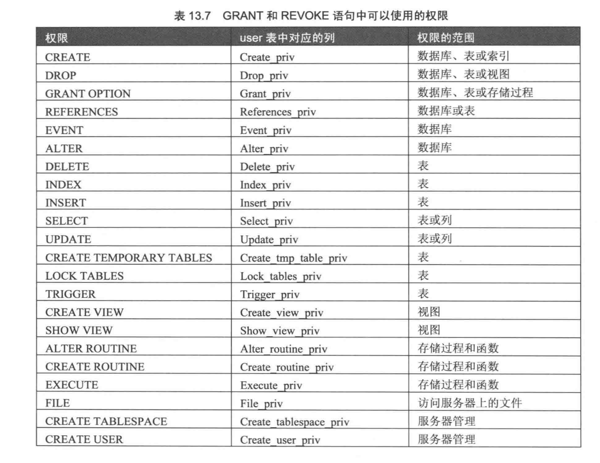
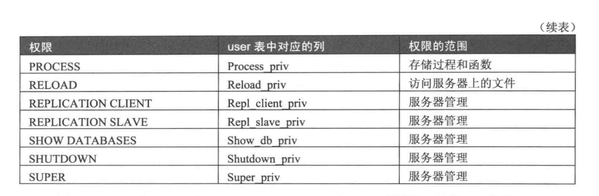
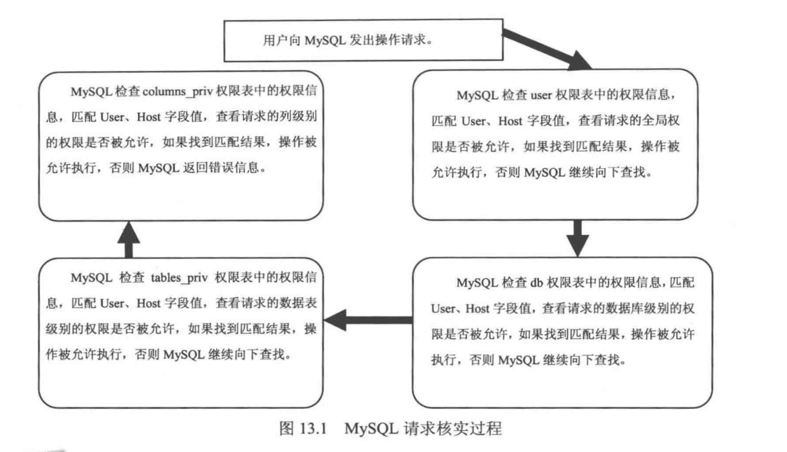

#### 一、概要

mysql 是一个多用户数据库，具有功能强大的访问控制系统，可以为不同用户指定允许的权限。mysql 用户可以分为普通用户和 root 用户。root 用户是超级管理员，拥有所有的权限，包括创建用户、删除用户和修改用户的密码等管理权限。普通用户只拥有被授予的各种权限。


#### 二、权限表

> user 表

user 表是 mysql 中最重要的一个权限表，记录允许链接到服务器的账号信息，里面的 **权限** 是全局的。例如一个用户在 user 表中被赋予了  DELETE 权限，则该用户可以删除 mysql 服务器中所有数据库中的任何记录。

user 表的字段大致可分为 用户列、权限列、安全列和资源控制列。


> db 表 和 host 表

db 表和 host 表是 mysql 数据库中非常重要的权限表。db 表中存储了用户对某个数据库的操作权限，决定用户能够从哪个主机存取哪个数据库。host 表中存储了某个主机对数据库的操作的权限，配合 db 权限表对给定主机上的数据库操作权限做更细致的控制。这个权限表不受 GRANT 和 REVOKE 语句的影响。db 表比较常用，host 表一般很少使用。db 表和 host 表的结构相似，字段大致可以分成两类：用户列和权限列。


> tables_priv 表和 columns_priv 表

tables_priv 表用来对表设置操作权限，columns_priv 表用来对表的某一列设置权限。


> procs_priv 表

proce_priv 表可以对存储过程和存储函数设置操作权限。


#### 三、账户管理

> 新建用户

````
CREATE USER user_specification
[, user_specification...] ...

user_specification:
    user@host
    [
        IDENTIFIED BY [PASSWORD] 'password'
        |
        IDENTIFIED WITH auth_plugin [AS 'auth_string']
    ]

============================================

example:

CREATE USER 'jeffrey'@'localhost' IDENTIFIED BY PASSWORD '*B552D554DDD3EE421E87404BE5D195BD5E8B8777'
````

````
GRANT privileges ON db.table
TO user@host [IDENTIFIED BY 'password']
[, user [IDENTIFIED  BY 'password'] ]
[WITH GRANT OPTION]

=============================================

example

GRANT SELECT, UPDATE ON *.* TO 'testUser'@'localhost' IDENTIFIED BY  PASSWORD '*B552D554DDD3EE421E87404BE5D195BD5E8B8777'
````

````
从 user 表直接添加记录
````

> 删除用户

````
DROP USER 'user'@'host'; // 删除当前域名的用户权限
DROP USER; // 删除用户在所有域名的权限
````

````
DELETE FROM user WHERE host="hostname" and user="username"
````

> root 用户修改自己的密码

````
1) 通过 mysqladmin
mysqladmin -u username -h host -p password "newpwd"

2）操作 user 表
UPDATE user set Password=PASSWORD("rootpwd") where User="root" and Host="host"

3)使用 set 语句
SET PASSWORD = PASSWORD("rootpwd")
````

> 修改他人密码

````
1）使用 set 语句
SET PASSWORD FOR 'user'@'host' = PASSWORD('somepassword') 

2）操作 user 表
UPDATE user set Password=PASSWORD("rootpwd") where User="root" and Host="host"
````

> 普通用户修改自己密码

````
SET PASSWORD = PASSWORD("rootpwd")
````

> 加载权限表

````
FLUSH PRIVILEGES;
````

#### 三、权限管理

权限管理主要是对登录到 mysql 的用户进行权限验证。所有用户的权限都存储在 mysql 的权限表中，不合理的权限规划会给 mysql 服务器带来安全隐患。数据库管理员要对所有用户的权限进行合理规划管理。mysql 权限系统的主要功能是证实连接到一台给定主机的用户，并且赋予该用户在数据库上的 SELECT INSERT UPDATE DELETE 权限。




> 授权

授权就是为了某个用户授予权限。合理的授权可以保证数据库安全。mysql 中可以使用 GRANT 语句为用户授予权限。授予的权限可以分为多个层级：

* 全局层级：全局权限适用于一个给定服务器中的所有数据库。这些权限存储在 mysql.user 表中。 GRANT ALL ON *.* 和 REVOKE ALL ON *.* 只授予和撤销全局权限。

* 数据库层级：数据库权限适用于一个给定数据库中的所有目标。这些权限存储在 mysql.db 和 mysql.host 表中。GRANT ALL on db_name 和 REVOKE ALL ON db_name.* 只授予和撤销数据库权限。

* 表层级：表权限适用于一个给定表中的所有列。这些权限存储在 mysql.table_priv 表中。GRANT ALL ON dn_name.tbl_name 和 REVOKE ALL ON db_name.tbl_name 只授予和撤销表权限。

* 列层级：列权限适用于一个给定表中的单一列。这些权限存储在 mysql.columns_priv 表中。当使用 REVOKE 时，必须指定与被授予列相同的列。

* 子程序层级：CREATE ROUTINE, ALTER ROUTINE, EXECUTE, GRANT 权限适用于以存储的子程序。这些权限可以被授予为全局层级和数据库层级。而且，除了 CREATE ROUTINE 外，这些权限可以被授予子程序层级，并存储在 mysql.procs_priv 表中。

> GRANT 语法
````
GRANT priv_type [(columns)] [, priv_type [columns]] ...
ON [object_type] table1, table2, ..., tablen
TO user [IDENTIFIED BY [PASSWORD] 'password']
[, user [IDENTIFIED BY [PASSWORD] 'password']...
[WITH GRANT OPTION]

object_type = TABLE | FUNCTION | PROCEDURE


example:
=============================================================

GRANT SELECT, INSERT ON *.* TO 'grantUser'@'localhost' IDENTIFIED BY 'grantpwd' WITH GRANT OPTION;
````

> 回收权限

回收权限就是取消已经赋予用户的某些权限。收回用户不必要的权限可以在一定程度上保证系统的安全性。mysql 中使用 REVOKE 语句取消用户的某些权限。使用 REVOKE 收回权限之后，用户账户的记录将从 db, host, tables_priv, columns_priv 表中删除，但是用户账户记录仍然在 user 表中保存。

在将用户账户从 user 表删除之前，应该收回相应用户的所有权限，REVOKE 语句有两种语法格式，第一种是收回所有用户的所有权限，此语法用于取消对于意命名的用户的所有全局层级、数据库层级、表层级和列层级的权限。

````
REVOKE ALL PRIVILEGES, GRANT OPTION 
FROM 'user'@'host' [, 'user'@'host' ...]
````

````
REVOKE priv_type [(columns)] [, priv_type [(columns)]]...
ON table1, table2, ..., tablen

example:
=======================================================

REVOKE INSERT on *.* FROM 'grantUser'@'localhost';

````

> 查看权限

````
SHOW GRANTS FOR 'user'@'host' 
````

#### 访问控制

正常情况下，并不希望每个用户都可以执行所有的数据库操作。当 mysql 允许一个用户执行各种操作时，它将首先核实该用户向 mysql 服务器发送的连接请求，然后确认用户的操作请求是否被允许
。mysql 的访问控制分为两个阶段：连接核实阶段和请求核实阶段。

> 连接核实阶段

当连接 mysql 服务时，服务器基于用户的身份以及用户是否能通过正确的密码身份验证来接受或拒绝链接。即客户端用户链接请求中会提供用户名称、主机地址名和密码，mysql 使用 user 表的 3 个字段（HOST、User、Password）执行身份检查，服务器只有在 user 表记录的 HOST 和 User 字段匹配客户端主机名和用户名，并且提供正确的密码是才接受连接。如果连接核实没有通过，服务器完全拒绝访问；否则，服务器接受连接，然后进入阶段 2 等待用户请求。

> 请求核实阶段

建立连接之后，服务器进入访问控制的阶段 2 。对在此连接上的每个请求，服务器检查用户要执行的操作，然后检查是否有足够的权限来执行它。这正是授权表中的权限列发挥作用的地方。这些权限可以来自 user、db、host、tables_priv 或 columns_priv 表。

