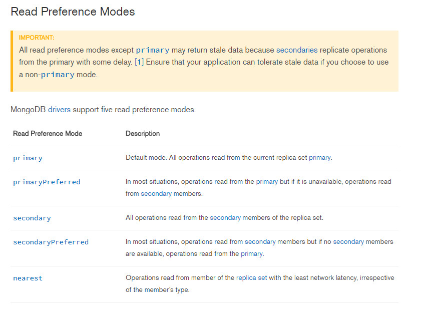

#### 一、数据集的写关注

#### 二、读取优先

默认情况下，一个应用直接从复制集的 primary 节点读取数据。

**重要**：当指定读取优先的时候，primary 以外的节点有可能会返回旧的数据，次要节点有可能还没有执行相应的 write operation。

**注意**：读取优先并不会影响数据的可见性。

**适用场景**

* 正在运行的体系操作并不会影响前端应用。

* 对于分布式应用，提供一个本地的读取。

> 如果你有一个应用服务位于多个数据中心。你可能想要一个分布式复制集，并且使用一个非 primary 或者 nearest 节点优先读取。这能令读取有更低的网络延迟，而不需要总是从 primary 读取数据。

* 在出错情况下，保持可用性

> 在正常情况下，使用 **primaryPreferred** 从 primary 节点读取数据。但是当 primary 节点不可用时，允许从 secondary 节点读取数据。在应用出错时，提供了只读的功能。

**不适用的场景**

通常情况下，不要使用 **secondary** 和 **secondaryPreferred** 去提供额外的容量。

#### 三、读取模型

#### 四、数据最大陈旧时间（maxStalenessSeconds）

由于网络延迟、磁盘吞吐量，较长的处理等原因，复制集的成员可以落后于 primary 节点。读取优先（read preference）的 **maxStalenessSeconds** 参数能够指定一个最大的延迟时间。如果从次要节点（secondaries）读取数据，当一个次要节点（secondariy）预计陈旧度超过 maxStalenessSeconds，客户端将会停止使用它。

**maxStalenessSeconds** 在 mongodb 3.4版本被引入，如果在之前的版本中使用，会报出错误。

你可以在下面的模式中使用 **maxStalenessSeconds**， Max staleness 不兼容 primary 模式，并且仅仅会在 选择的 secondary 的读操作中使用。

* primaryPreferred

* secondary

* secondaryPreferred

* nearest

#### 五、Tag Set

